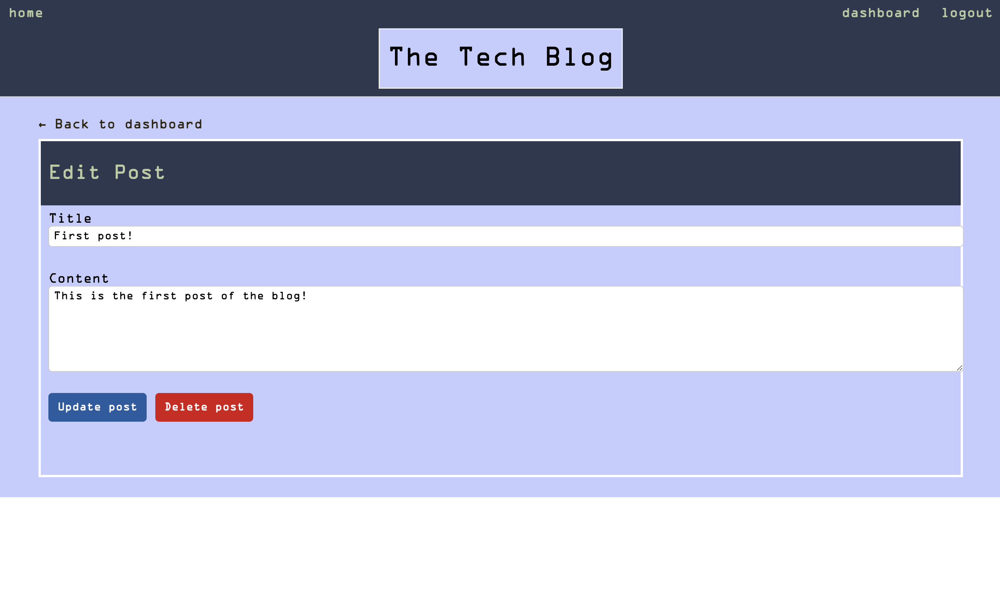

# Tech_Blog
CMS-style blog to publish articles, blog posts and thought and opinions

# Objectives
An application that when running:
- User is presented with the homepage
- Homepage, log-in, log-out and sign up navigation links take to the respective pages
- When prompted to sign-up, user is required to create a username and password
- When prompted to sign-in, user is allowed to sign-in with the same credentials they signed up
- When logged in:
    - User can see all posts on the dashboard
    - User can create a new post
    - When redirected to a specific post, user can comment on said post
- When being idle for 30 minutes user will be logged out
- When clicking the log out button, user session will be destroyed

# Deployed Application Link

# Images

